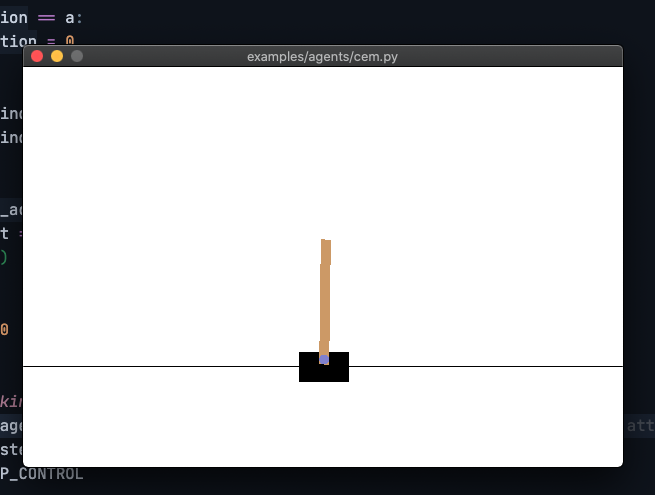

強化学習のシミュレーターを作ってみたいなということで、強化学習のフレームワークである Gym を動かしてみようと思いました。

## なにはともあれ Python の環境を用意する

Python 自体普段は触っていないので手探りでした。結局は`pyenv`+`venv`で落ち着いています。

手元環境は

- MacOS Monterey 12.3.1
- Homebrew

です。

Python 本体、複数バージョンを管理するための候補は

- brew
- pyenv
- miniconda
- anaconda

でした。

仮想環境の候補としては

- venv
- pyenv-virtualenv
- pipenv
- miniconda
- anaconda

がありました。

Python 本体、複数バージョンの管理は、他の言語でも使い慣れている`pyenv`を選びました。

仮想環境は、`venv`を使うことにしたのは、公式の[venv --- 仮想環境の作成 — Python 3.10.4 ドキュメント](https://docs.python.org/ja/3/library/venv.html?highlight=env#an-example-of-extending-envbuilder)で紹介されていたことが決め手でした。
以前 Python を触っていたときに使っていた`pipenv`は開発が止まっていたこと、`conda`系は動かすだけだとコマンド追加などで過剰に感じたことも、後押ししました。
`pyenv-virutualenv`は`venv`と同じ動作で使えますが、標準ライブラリとして取り込まれている`venv`の方がなんとなく軽くてエラーが発生しないかなと思ってます。
`venv`と`virtualenv`の違いは、[Virtualenv — virtualenv 20.14.2.dev2+g8d78ee0 documentation](https://virtualenv.pypa.io/en/latest/)より、機能の多さ、動作の軽さのようです。

以下開発環境構築時のコマンドラインです。

```sh
brew install pyenv pyenv-virtualenv
# 以下二行を.bash_profile等に書き込む
# eval "$(pyenv init -)"
# eval "$(pyenv virtualenv-init -)"

pyenv install 3.8.8

cd path/to/project

pyenv local 3.8.8
python -m venv <venvname>
source <venvname>/bin/activate
pip install --upgrade pip
```

## Gym を動かす

以下リンクを参考に、Gym を動かします。

- [Gym](https://gym.openai.com/)
- [Gym Docs](http://gym.openai.com/docs/)
- [openai/retro: Retro Games in Gym](https://github.com/openai/retro)

## README に沿って動かしてみる

```sh
git clone https://github.com/openai/gym
pip install -e gym
// examples/agentsにあるプログラムを実行してみる
python examples/agents/cem.py
```

実行されると棒が倒れないように台座を動かしている。


`examples/agents`配下は以下の通り。`cem.py`のみ学習アルゴリズムが実行されている

### `random_agent.py`

毎回リセットして、RandomAgent.act を実行。

<https://github.com/openai/gym/blob/4c460ba6c8959dd8e0a03b13a1ca817da6d4074f/examples/agents/random_agent.py#L39-L45>
<https://github.com/openai/gym/blob/4c460ba6c8959dd8e0a03b13a1ca817da6d4074f/examples/agents/random_agent.py#L6-L13>

### `cem.py`

交差エントロピー[交差エントロピーの例と微分の計算 - 具体例で学ぶ数学](https://mathwords.net/kousaentropy#:~:text=%E4%BA%A4%E5%B7%AE%E3%82%A8%E3%83%B3%E3%83%88%E3%83%AD%E3%83%94%E3%83%BC%E3%81%AF%E3%80%81%E6%A9%9F%E6%A2%B0%E5%AD%A6%E7%BF%92,%E8%80%83%E3%81%88%E3%82%8B%E3%81%93%E3%81%A8%E3%81%8C%E3%81%A7%E3%81%8D%E3%81%BE%E3%81%99%E3%80%82)を学習アルゴリズムとして使っています。

ここでモデルのトレーニングをしていて、cem メソッドが交差エントロピーの計算処理本体となってます。
<https://github.com/openai/gym/blob/3bd5ef71c2ca3766a26c3dacf87a33a9390ce1e6/examples/agents/cem.py#L87-L93>

### `keyboard_agent.py`

キーボード入力を受付けているようですが、依存パッケージ足らなくて動きませんでした。

## [openai/retro: Retro Games in Gym](https://github.com/openai/retro)を動かしてみる

[Getting Started — Gym Retro documentation](https://retro.readthedocs.io/en/latest/getting_started.html)

```sh
pip install gym-retro

python -m retro.examples.brute --game Airstriker-Genesis
```

[retro/retro/examples at master · openai/retro](https://github.com/openai/retro/tree/master/retro/examples)
に評価アルゴリズムの例があります。評価アルゴリズムはライブラリとして呼び出しを行います。`python -m retro.examples.brute --game Airstriker-Genesis`では`retro.example.brute`が指定されています。

以下のコードで使えるゲーム一覧を表示できます。ROM が同梱されているわけではなく、別個用意する必要があるようです。

```python
import retro
print(retro.data.list_games()))
```

## 終わりに

Python の環境構築から実際に動かすまでやってみました。Python の実行環境を用意するのは毎回少し調べたり、手間がかかっていましたが、今回は公式のドキュメントに`venv`があったのですんなり行きました。
